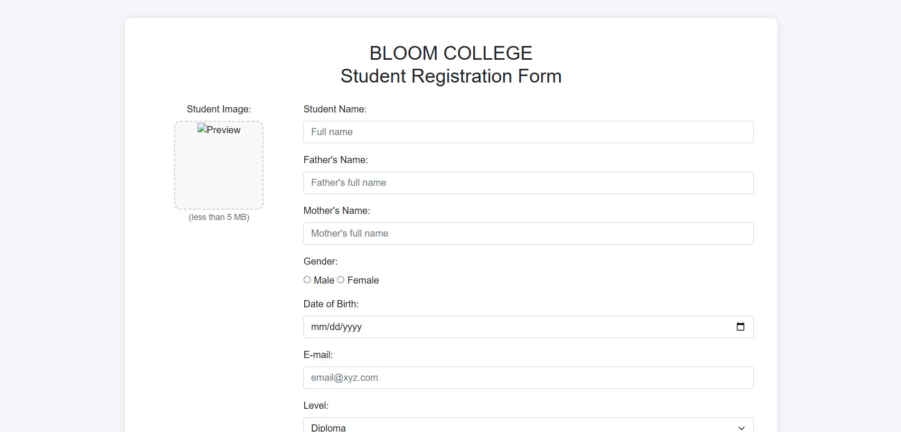
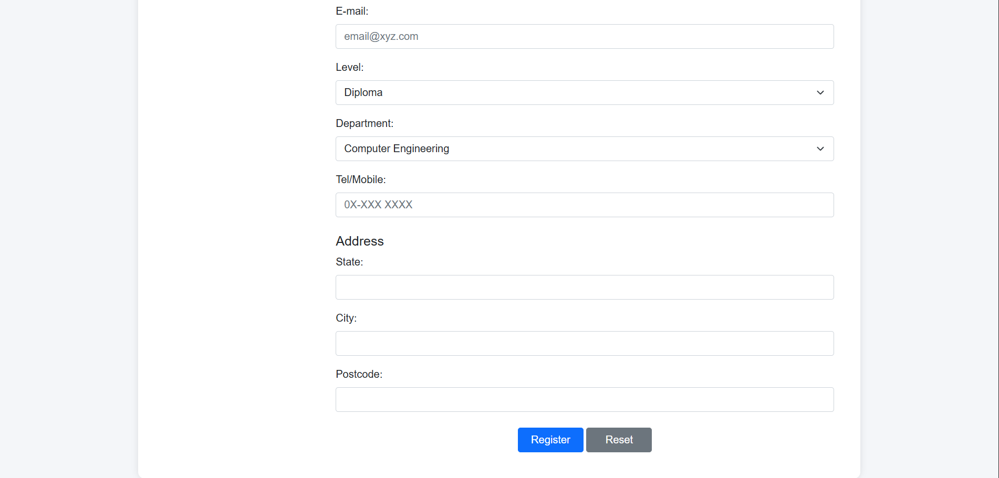
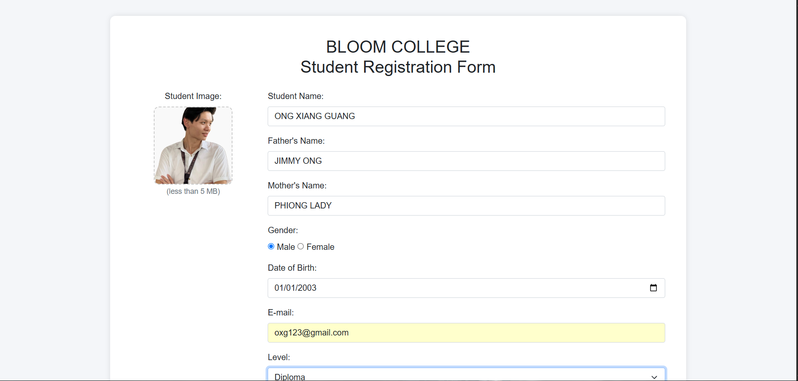
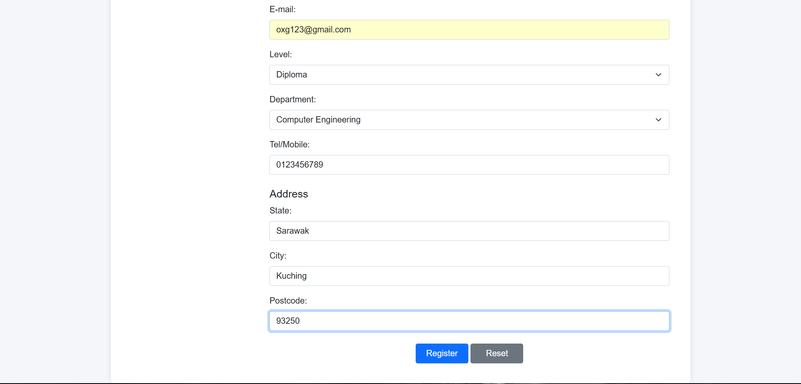

# pw2
A simple student registration form project using HTML, CSS, JavaScript, and Bootstrap.

## Overview
The purpose of this PW2 project is to apply knowledge of web form design and JavaScript event handling.
It demonstrates the use of input validation, event attributes (onBlur, onFocus, onChange), image upload preview, and modal confirmation message.

## Features
- **Student Registration Form** – Collects student details such as name, email, gender, address, and contact number.
- **Image Upload with Preview** – Allows users to upload and preview their student image in a square frame.
- **JavaScript Event Handling** – Allows user login with simple credential validation (`student / 1234`) and session handling using `localStorage`.

###  JavaScript Event Handling
Implements the following interactive functions:
- **onFocus** – Highlights the email input field.  
- **onBlur** – Checks for a valid email format.  
- **onChange** – Automatically converts names (Student, Father, Mother) to uppercase.
- **onClick (Register Button)** – Upon submission, displays a Bootstrap modal with the message *"Your details have been saved."*  

## Technologies Used
- HTML, CSS, JS
- Bootstrap
- ChatGPT

## Screenshot

## Installation
1. Clone this repository
2. Open in VS Code
3. Run using Live Server

## Contributors
- Name: ONG XIANG GUANG
- Course: DFK20013 WEB DESIGN TECHNOLOGY
- Institution: Politeknik Kuching Sarawak
